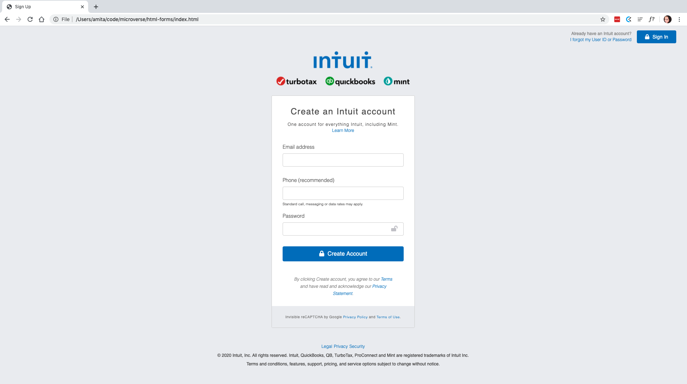

# html-forms

> HTML Forms

- Live Demo: [@signUp-Page](https://raw.githack.com/Amita-Roy/html-forms/sign-up/index.html)

## Built With

- HTML
- CSS
  ​

## Getting Started

​
**To get a local copy up and running follow these simple example steps.**
​
​

### Prerequisites

A computer.
A browser of preference.
​

## Authors

​
👤 **Amita Roy**
​

- Github: [@githubhandle](https://github.com/Amita-Roy)

👤 **Ershadul Hakim Rayhan**
​

- Github: [@githubhandle](https://github.com/ershadul1)
  ​

## �� Contributing

​Feedback is always appreciated! Help us by adding an issue.
​

## Show your support

​Give a ⭐️ if you like this project!
​

## Acknowledgments

​- This sign up page is a clone from mint.com website. Thanks mint.com for giving us the inspiration
​

## �� License

​
This project is [MIT](lic.url) licensed.
